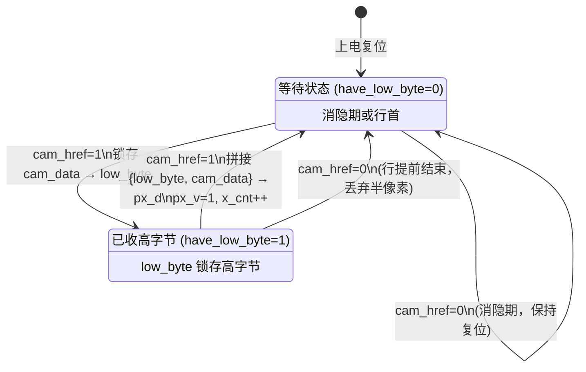

# 字节拼装状态转换图

```mermaid
stateDiagram-v2
    [*] --> IDLE : 上电复位

    IDLE : 等待状态 (have_low_byte=0)
    IDLE : 消隐期或行首

    WAIT_LOW : 已收高字节 (have_low_byte=1)
    WAIT_LOW : low_byte 锁存高字节

    IDLE --> WAIT_LOW : cam_href=1\n锁存 cam_data → low_byte
    WAIT_LOW --> IDLE : cam_href=1\n拼接 {low_byte, cam_data} → px_d\npx_v=1, x_cnt++

    IDLE --> IDLE : cam_href=0\n(消隐期，保持复位)
    WAIT_LOW --> IDLE : cam_href=0\n(行提前结束，丢弃半像素)
```
