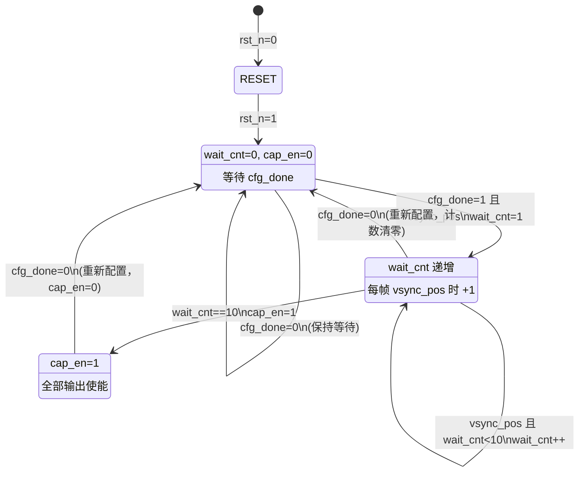

# 图3-3: 10帧等待状态转换图

```mermaid
stateDiagram-v2
    [*] --> RESET : rst_n=0
    RESET --> WAIT_CFG : rst_n=1

    WAIT_CFG : wait_cnt=0, cap_en=0
    WAIT_CFG : 等待 cfg_done

    COUNTING : wait_cnt 递增
    COUNTING : 每帧 vsync_pos 时 +1

    ACTIVE : cap_en=1
    ACTIVE : 全部输出使能

    WAIT_CFG --> WAIT_CFG : cfg_done=0\n(保持等待)
    WAIT_CFG --> COUNTING : cfg_done=1 且 vsync_pos\nwait_cnt=1

    COUNTING --> COUNTING : vsync_pos 且 wait_cnt<10\nwait_cnt++
    COUNTING --> ACTIVE : wait_cnt==10\ncap_en=1
    COUNTING --> WAIT_CFG : cfg_done=0\n(重新配置，计数清零)

    ACTIVE --> WAIT_CFG : cfg_done=0\n(重新配置，cap_en=0)
```
