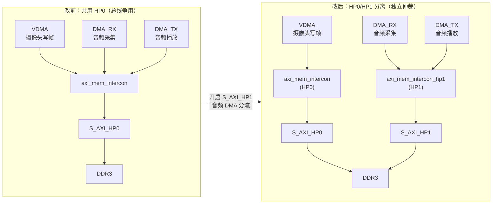

# 图4-3: HP0/HP1 总线分流前后对比

```mermaid
flowchart LR
    subgraph BEFORE["改前：共用 HP0（总线争用）"]
        VDMA1["VDMA\n摄像头写帧"] --> M1["axi_mem_intercon"]
        DMA_RX1["DMA_RX\n音频采集"] --> M1
        DMA_TX1["DMA_TX\n音频播放"] --> M1
        M1 --> HP01["S_AXI_HP0"] --> DDR1["DDR3"]
    end

    subgraph AFTER["改后：HP0/HP1 分离（独立仲裁）"]
        VDMA2["VDMA\n摄像头写帧"] --> M2["axi_mem_intercon\n(HP0)"]
        M2 --> HP02["S_AXI_HP0"] --> DDR2["DDR3"]
        DMA_RX2["DMA_RX\n音频采集"] --> M3["axi_mem_intercon_hp1\n(HP1)"]
        DMA_TX2["DMA_TX\n音频播放"] --> M3
        M3 --> HP12["S_AXI_HP1"] --> DDR2
    end

    BEFORE -.->|"开启 S_AXI_HP1\n音频 DMA 分流"| AFTER
```
