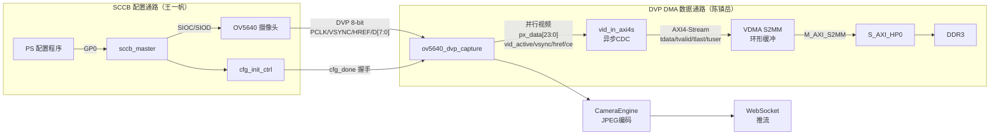

# 图4-1: 视频通路集成框图

```mermaid
flowchart LR
    subgraph WYF["SCCB 配置通路（王一帆）"]
        PS1["PS 配置程序"] -->|"GP0"| SCCB["sccb_master"]
        SCCB -->|"SIOC/SIOD"| OV["OV5640 摄像头"]
        SCCB --> CFG["cfg_init_ctrl"]
    end

    subgraph CZY["DVP DMA 数据通路（陈镇岳）"]
        OV -->|"DVP 8-bit\nPCLK/VSYNC/HREF/D[7:0]"| DVP["ov5640_dvp_capture"]
        CFG -->|"cfg_done 握手"| DVP
        DVP -->|"并行视频\npx_data[23:0]\nvid_active/vsync/href/ce"| VID["vid_in_axi4s\n异步CDC"]
        VID -->|"AXI4-Stream\ntdata/tvalid/tlast/tuser"| VDMA["VDMA S2MM\n环形缓冲"]
        VDMA -->|"M_AXI_S2MM"| HP0["S_AXI_HP0"]
        HP0 --> DDR["DDR3"]
    end

    DVP --> CAM["CameraEngine\nJPEG编码"]
    CAM --> WS["WebSocket\n推流"]
```
