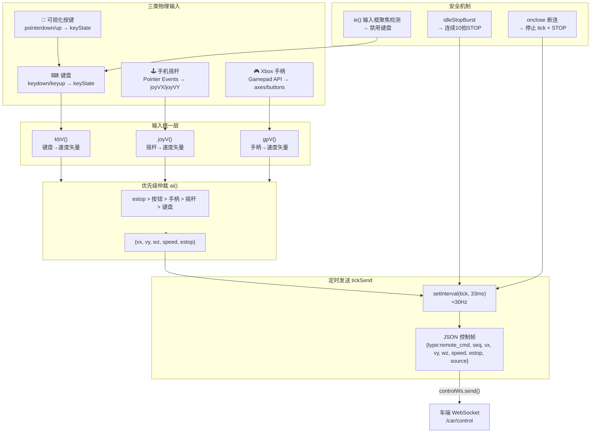

# 图3-19: 多模输入统一架构图

```mermaid
flowchart TD
    subgraph INPUT["三类物理输入"]
        KB["⌨ 键盘\nkeydown/keyup → keyState"]
        JOY["🕹 手机摇杆\nPointer Events → joyVX/joyVY"]
        GP["🎮 Xbox 手柄\nGamepad API → axes/buttons"]
        BTN["🔘 可视化按键\npointerdown/up → keyState"]
    end

    subgraph MERGE["输入统一层"]
        KBV["kbV()\n键盘→速度矢量"]
        JV["joyV()\n摇杆→速度矢量"]
        GPV["gpV()\n手柄→速度矢量"]
    end

    subgraph ARB["优先级仲裁 ai()"]
        PRIO["estop > 按钮 > 手柄 > 摇杆 > 键盘"]
        VEC["{vx, vy, wz, speed, estop}"]
    end

    subgraph SEND["定时发送 tickSend"]
        TIMER["setInterval(tick, 33ms)\n≈30Hz"]
        JSON["JSON 控制帧\n{type:remote_cmd, seq, vx, vy, wz, speed, estop, source}"]
    end

    subgraph SAFE["安全机制"]
        IE["ie() 输入框聚焦检测\n→ 禁用键盘"]
        IDLE["idleStopBurst\n→ 连续10拍STOP"]
        DC["onclose 断连\n→ 停止 tick + STOP"]
    end

    KB --> KBV
    BTN --> KB
    JOY --> JV
    GP --> GPV
    KBV & JV & GPV --> ARB
    ARB --> VEC --> TIMER --> JSON
    JSON -->|"controlWs.send()"| CAR["车端 WebSocket\n/car/control"]
    IE --> KB
    IDLE --> TIMER
    DC --> TIMER
```
