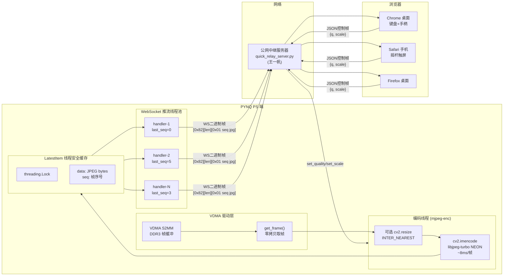

# 图3-17: MJPEG编码+推流线程架构图

```mermaid
flowchart LR
    subgraph PS["PYNQ PS 端"]
        subgraph DRV["VDMA 驱动层"]
            DMA["VDMA S2MM\nDDR3 帧缓冲"]
            GF["get_frame()\n零拷贝取帧"]
        end

        subgraph ENC["编码线程 (mjpeg-enc)"]
            RESIZE["可选 cv2.resize\nINTER_NEAREST"]
            JPEG["cv2.imencode\nlibjpeg-turbo NEON\n~8ms/帧"]
        end

        subgraph CACHE["LatestItem 线程安全缓存"]
            LOCK["threading.Lock"]
            DATA["data: JPEG bytes\nseq: 帧序号"]
        end

        subgraph WS["WebSocket 推流线程池"]
            H1["handler-1\nlast_seq=0"]
            H2["handler-2\nlast_seq=5"]
            H3["handler-N\nlast_seq=3"]
        end
    end

    subgraph NET["网络"]
        RELAY["公网中继服务器\nquick_relay_server.py\n(王一帆)"]
    end

    subgraph CLIENT["浏览器"]
        B1["Chrome 桌面\n键盘+手柄"]
        B2["Safari 手机\n摇杆触屏"]
        B3["Firefox 桌面"]
    end

    DMA --> GF --> RESIZE --> JPEG --> CACHE
    CACHE --> H1 & H2 & H3
    H1 & H2 & H3 -->|"WS二进制帧\n[0x82][len][0x01 seq jpg]"| RELAY
    RELAY --> B1 & B2 & B3
    B1 & B2 & B3 -->|"JSON控制帧\n{q, scale}"| RELAY
    RELAY -->|"set_quality/set_scale"| ENC
```
