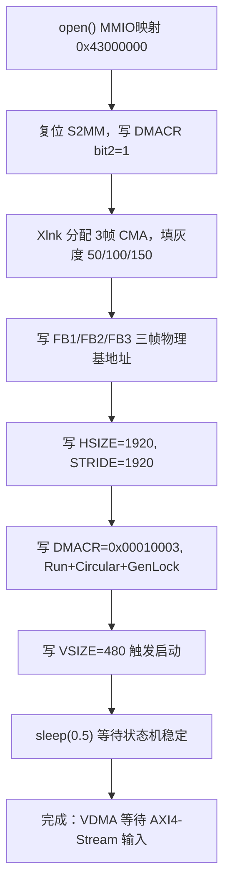

# 图3-12: VDMA寄存器配置时序流程图

```mermaid
flowchart TD
    A["open() MMIO映射 0x43000000"] --> B["复位 S2MM，写 DMACR bit2=1"]
    B --> C["Xlnk 分配 3帧 CMA，填灰度 50/100/150"]
    C --> D["写 FB1/FB2/FB3 三帧物理基地址"]
    D --> E["写 HSIZE=1920, STRIDE=1920"]
    E --> F["写 DMACR=0x00010003, Run+Circular+GenLock"]
    F --> G["写 VSIZE=480 触发启动"]
    G --> H["sleep(0.5) 等待状态机稳定"]
    H --> I["完成：VDMA 等待 AXI4-Stream 输入"]
```
