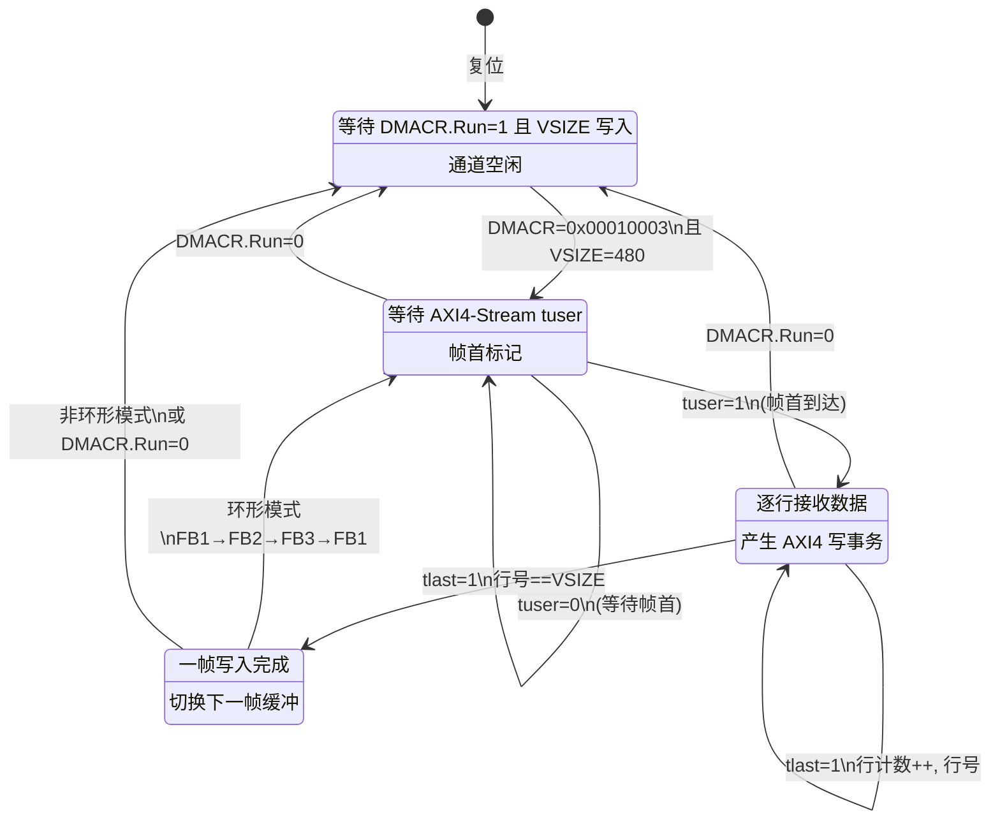

# 图3-10: VDMA S2MM状态转换图

```mermaid
stateDiagram-v2
    [*] --> Idle : 复位

    Idle : 等待 DMACR.Run=1 且 VSIZE 写入
    Idle : 通道空闲

    WaitForSOF : 等待 AXI4-Stream tuser
    WaitForSOF : 帧首标记

    LineTransfer : 逐行接收数据
    LineTransfer : 产生 AXI4 写事务

    FrameDone : 一帧写入完成
    FrameDone : 切换下一帧缓冲

    Idle --> WaitForSOF : DMACR=0x00010003\n且 VSIZE=480

    WaitForSOF --> WaitForSOF : tuser=0\n(等待帧首)
    WaitForSOF --> LineTransfer : tuser=1\n(帧首到达)

    LineTransfer --> LineTransfer : tlast=0\n(行内数据传输)
    LineTransfer --> LineTransfer : tlast=1\n行计数++, 行号<VSIZE
    LineTransfer --> FrameDone : tlast=1\n行号==VSIZE

    FrameDone --> WaitForSOF : 环形模式\nFB1→FB2→FB3→FB1
    FrameDone --> Idle : 非环形模式\n或 DMACR.Run=0

    WaitForSOF --> Idle : DMACR.Run=0
    LineTransfer --> Idle : DMACR.Run=0
```
