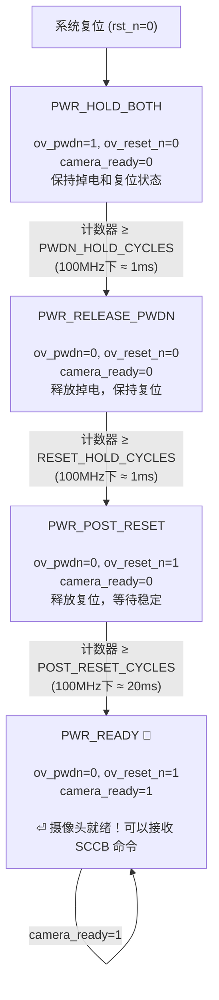
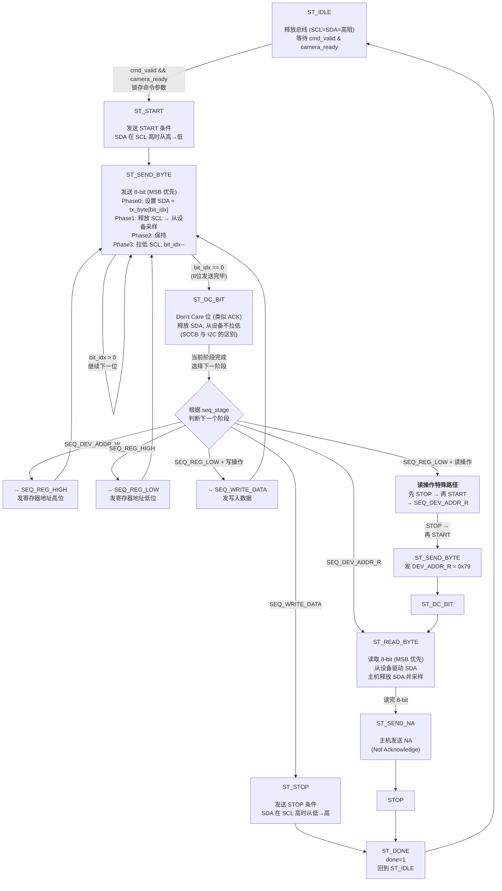
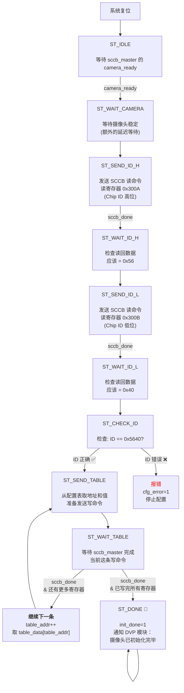
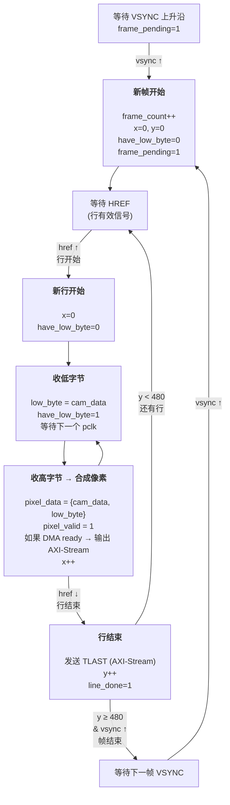

# 状态机全集 — OV5640 DVP 采集 PL 设计

整个 PL 设计中存在 **3 个显式 FSM** 和 **1 个隐式状态机**，分布在不同的模块中：

---

## 目录

1. [sccb_master — 摄像头上电时序 FSM](#1-sccb_master--摄像头上电时序-fsm)
2. [sccb_master — SCCB 总线事务 FSM](#2-sccb_master--sccb-总线事务-fsm)
3. [ov5640_cfg_init_ctrl — OV5640 配置流程 FSM](#3-ov5640_cfg_init_ctrl--ov5640-配置流程-fsm)
4. [ov5640_dvp_capture — 像素采集隐式状态机](#4-ov5640_dvp_capture--像素采集隐式状态机)

---

## 1. sccb_master — 摄像头上电时序 FSM

**所在文件：** `sccb_master.v`
**时钟域：** FCLK_CLK0 (100MHz)
**目的：** 控制 OV5640 的上电时序，确保摄像头在正确的 PWDN/RESET_N 序列后稳定

### 时序要求（来自 OV5640 数据手册）

```
VCC    ━━━━━━━━━━━━━━━━━━━━━━━━━━━━━━━━━━━━━━━━━━━━━━━━━━
PWDN   ━━━━━━━━━━━━┓                                    ┃
RESET_N━━━━━━━━━━━━━━━━━━━━━━━━━┓                        ┃
camera_ready                   ┃                  ━━━━━━┃━━━━━
                     t1=1ms    t2=1ms          t3=20ms
              PWDN=1, RESET=0   PWDN=0, RESET=0   PWDN=0, RESET=1
               (掉电+复位)       (仅复位)            (释放复位)
                                    ← 总共 ~22ms →
```

### 状态转移图



### 核心 Verilog 代码结构

```verilog
always @(posedge clk or negedge rst_n) begin
    case (pwr_state)
        PWR_HOLD_BOTH: begin
            // 保持 PWDN=1, RESET_N=0
            if (pwr_cnt >= PWDN_HOLD_CYCLES - 1) begin
                pwr_cnt <= 0; pwr_state <= PWR_RELEASE_PWDN;
            end else pwr_cnt <= pwr_cnt + 1;
        end
        PWR_RELEASE_PWDN: begin
            // PWDN=0, RESET_N=0
            if (pwr_cnt >= RESET_HOLD_CYCLES - 1) begin
                pwr_cnt <= 0; pwr_state <= PWR_POST_RESET;
            end else pwr_cnt <= pwr_cnt + 1;
        end
        PWR_POST_RESET: begin
            // PWDN=0, RESET_N=1
            if (pwr_cnt >= POST_RESET_CYCLES - 1) begin
                pwr_cnt <= 0; pwr_state <= PWR_READY;
                camera_ready <= 1'b1;
            end else pwr_cnt <= pwr_cnt + 1;
        end
        default: begin pwr_state <= PWR_READY; end
    endcase
end
```

### 参数配置

| 参数 | 值 | 时钟周期数 @100MHz | 实际时间 |
|------|-----|-------------------|---------|
| `PWDN_HOLD_US` | 1000 | `100,000,000 / 1,000,000 × 1000 = 100,000` | 1ms |
| `RESET_HOLD_US` | 1000 | `100,000,000 / 1,000,000 × 1000 = 100,000` | 1ms |
| `POST_RESET_US` | 20000 | `100,000,000 / 1,000,000 × 20000 = 2,000,000` | 20ms |

---

## 2. sccb_master — SCCB 总线事务 FSM

**所在文件：** `sccb_master.v`
**时钟域：** FCLK_CLK0 (100MHz)
**目的：** 在 SCCB 总线上执行读写操作，产生符合协议的 SCL/SDA 时序

### 协议时序（每 SCL 周期 4 个子相位）

```
          Phase 0    Phase 1    Phase 2    Phase 3    Phase 0
SCL      ━━┓        ┏━┓        ┏━┓        ┏━┓        ┏━
            ┃        ┃┃        ┃┃        ┃┃        ┃┃
            ┃        ┃┃        ┃┃        ┃┃        ┃┃
SDA      ━━━╋━━━━━━━━╋━━━━━━━━━╋━━━━━━━━━╋━━━━━━━━━━━━━
              │        │          │          │
          SCL 低     SCL 高    保持     SCL 低
          设置 SDA   采样 SDA   (延迟)    改变 SDA
```

Phase 时序：每一相的宽度由 `CLK_DIVIDER = 250` 控制（2.5μs @ 100MHz）。

### 状态转移图



### 写操作完整序列（3 阶段）

```
ST_IDLE → ST_START → ST_SEND_BYTE × 8 → ST_DC_BIT   ← 阶段1: 设备地址 0x78
                    → ST_SEND_BYTE × 8 → ST_DC_BIT   ← 阶段2: 寄存器高位
                    → ST_SEND_BYTE × 8 → ST_DC_BIT   ← 阶段3: 寄存器低位
                    → ST_SEND_BYTE × 8 → ST_DC_BIT   ← 阶段4: 写入数据
                    → ST_STOP → ST_DONE
```

### 读操作完整序列（2 段 + 重启）

```
ST_IDLE → ST_START → ST_SEND_BYTE × 8 → ST_DC_BIT   ← 阶段1: 设备地址 0x78
                    → ST_SEND_BYTE × 8 → ST_DC_BIT   ← 阶段2: 寄存器高位
                    → ST_SEND_BYTE × 8 → ST_DC_BIT   ← 阶段3: 寄存器低位
                    → ST_STOP                         ← 先停止！
                    → ST_START (重启)
                    → ST_SEND_BYTE × 8 → ST_DC_BIT   ← 阶段4: 读地址 0x79
                    → ST_READ_BYTE × 8                ← 从设备发数据
                    → ST_SEND_NA → ST_STOP → ST_DONE
```

### 开漏输出逻辑

```verilog
assign sioc_o = 1'b0;           // 永远输出低
assign sioc_t = ~hold_scl_low;  // 1=释放(上拉高), 0=驱动(拉低)
assign siod_o = 1'b0;
assign siod_t = ~hold_sda_low;
```

---

## 3. ov5640_cfg_init_ctrl — OV5640 配置流程 FSM

**所在文件：** `ov5640_cfg_init_ctrl.v`
**时钟域：** FCLK_CLK0 (100MHz)
**目的：** 依次发送 270+ 个 SCCB 写命令，初始化 OV5640 的寄存器配置

### 配置数据流关系

```
cfg_init_ctrl FSM                    sccb_master
┌──────────────────┐   cmd_valid    ┌────────────────┐
│ ST_SEND_ID_H     │ ──────────────►│ 事务 FSM        │ ◄── 到 SDA/SCL 引脚
│ ST_SEND_ID_L     │   cmd_ready    │ ST_START → ...  │
│ ST_SEND_TABLE    │ ◄──────────────│ → ST_DONE       │
│  (270+ 寄存器)   │   done/error   │                 │
└──────────────────┘                └────────────────┘
```

### 状态转移图



### 三段配置表

| 段 | 寄存器数量 | 内容 |
|------|-----------|-------|
| PREAMBLE | 2 | 软复位：(1) `0x3103 = 0x11`, (2) `0x3008 = 0x82` |
| INIT | 207 | PLL/ADC/AGC/AWB/ISP/伽马，`0x4300=0x30` (RGB565)，`0x4740=0x21` (DVP) |
| MODE | 60 | VGA 640×480, 30fps, `0x4300=0x6F` (RGB565), PLL 分频 |

总共 **269 个寄存器**，全部写完大约需要 `269 × (9 × 4 × 2.5μs) ≈ 24ms`（在 100kHz SCCB 频率下）。

### 与上电 FSM 的时序关系

```
时间轴 (ms):  0         1         2                 22             46             70
              |─────────|─────────|──────────────────|──────────────|──────────────┤
上电 FSM:     HOLD      RELEASE   POST_RESET         READY
                                                        ↓
配置 FSM:                                            WAIT_CAM → ID_H → ID_L → CHECK → SEND_TABLE... → DONE
                                                         (读ID~0.5ms)    (写269寄存器 ~24ms)
```

---

## 4. ov5640_dvp_capture — 像素采集隐式状态机

**所在文件：** `ov5640_dvp_capture.v`
**时钟域：** cam_pclk (~56MHz)
**形式：** 这是**用条件逻辑实现的状态机**，没有统一的 `case` 语句，而是通过 `have_low_byte`、`frame_pending` 等标志位隐式维护状态

### 状态转移图



### 关键控制标志

| 标志 | 作用 | 置位条件 | 清除条件 |
|------|------|---------|---------|
| `have_low_byte` | 是否已收到像素的低字节 | 收到一个字节时 | 组成像素后、行开始时、帧开始时 |
| `frame_pending` | 帧的第一个像素还没发 | 帧开始 (vsync↑) | 发出了第一个像素时 |
| `line_has_pixel` | 当前行已有有效像素 | 第一个像素组成时 | 行结束、帧开始时 |

### AXI-Stream 输出逻辑

```verilog
// 像素合成完成，输出 AXI-Stream
if (m_axis_tready) begin
    m_axis_tvalid <= 1'b1;
    m_axis_tdata  <= {cam_data, low_byte};  // 16-bit RGB565
    m_axis_tuser  <= frame_pending;          // 帧首标志 (每帧第一个像素)
    // m_axis_tlast 在行结束时由 HREF 下降沿驱动
end
```

注意：如果 DMA 没准备好（`m_axis_tready=0`），这个像素**直接丢弃**——因为 DVP 是实时接口，不能暂停。这也是为什么后面有 XPM FIFO 缓冲。

---

## 总结

| # | 状态机 | 所在模块 | 类型 | 状态数 | 用途 |
|---|-------|---------|------|-------|------|
| 1 | 上电时序 | `sccb_master` | 显式 FSM (`case`) | 4 | 控制 OV5640 PWDN/RESET 时序 |
| 2 | SCCB 事务 | `sccb_master` | 显式 FSM (`case`) | 8 | 在 SCCB 总线上执行读写 |
| 3 | 配置流程 | `ov5640_cfg_init_ctrl` | 显式 FSM | 10+ | 发送 270 个配置寄存器 |
| 4 | 像素采集 | `ov5640_dvp_capture` | 隐式（条件逻辑） | — | VSYNC/HREF 边沿检测 + 像素重组 |
