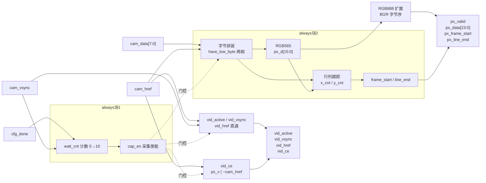

# ov5640_dvp_capture IP 内部数据流

```mermaid
flowchart LR
    %% 输入
    DATA["cam_data[7:0]"]
    HREF["cam_href"]
    VSYNC["cam_vsync"]
    CFG["cfg_done"]

    %% always块1
    subgraph A1["always块1"]
        WAIT["wait_cnt 计数 0→10"]
        CAPEN["cap_en 采集使能"]
    end

    %% always块2
    subgraph A2["always块2"]
        BYTE["字节拼装<br/>have_low_byte 两相"]
        PXD["RGB565<br/>px_d[15:0]"]
        XY["行列跟踪<br/>x_cnt / y_cnt"]
        FSLE["frame_start / line_end"]
    end

    %% assign
    RGB["RGB888 扩展<br/>BGR 字节序"]
    CE["vid_ce<br/>px_v | ~cam_href"]
    PASSTHRU["vid_active / vid_vsync<br/>vid_href 直通"]

    %% 输出
    PX["px_valid<br/>px_data[23:0]<br/>px_frame_start<br/>px_line_end"]
    VID["vid_active<br/>vid_vsync<br/>vid_href<br/>vid_ce"]

    %% 连线
    CFG --> WAIT
    VSYNC --> WAIT
    WAIT --> CAPEN

    DATA --> BYTE
    HREF --> BYTE
    CAPEN -.->|"门控"| BYTE

    BYTE --> PXD
    BYTE --> XY
    PXD --> XY
    XY --> FSLE

    PXD --> RGB
    RGB --> PX
    FSLE --> PX

    HREF --> PASSTHRU
    VSYNC --> PASSTHRU
    CAPEN -.->|"门控"| PASSTHRU

    HREF --> CE
    CAPEN -.->|"门控"| CE

    PASSTHRU --> VID
    CE --> VID
```
